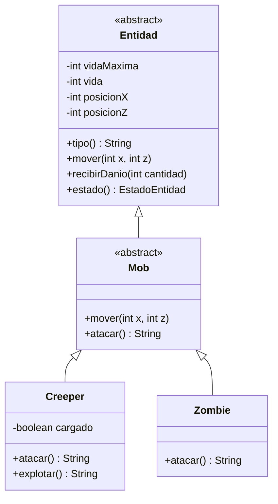

# Bitacora del Taller de Git y Modelado Orientado a Objetos

## Datos de la entrega

- **Estudiante:** Marcelo Nicolas Romero Insfran
- **Usuario de GitHub:** `mnri1904`
- **Comision:** CYT646 F
- **Dominio elegido:** Minecraft
- **Repositorio:** [mnri1904/mnri-taller-git-2026](https://github.com/mnri1904/mnri-taller-git-2026)
- **Licencia:** Apache License 2.0

## Objetivo

El trabajo consistio en publicar una API REST propia con Spring Boot y aplicar
al dominio Minecraft el modelado desarrollado en las clases del 2 y 3 de
septiembre. La solucion utiliza ocultamiento de informacion, herencia,
sobreescritura y polimorfismo. El proceso quedo registrado mediante commits,
ramas y pull requests.

## Bitacora de trabajo

### 1. Creacion del repositorio

Se creo el repositorio publico `mnri-taller-git-2026` con un archivo README y
la licencia Apache 2.0. Se configuro Git con el usuario `mnri1904` y se utilizo
SSH para las operaciones posteriores de `pull` y `push`.

El repositorio contiene un `.gitignore` para Java, Maven y los entornos de
desarrollo. Los directorios generados, como `target/`, no se versionan.

### 2. Proyecto Spring Boot

Se incorporo un proyecto generado con las siguientes caracteristicas:

- Maven.
- Java 21.
- Spring Boot 3.5.16.
- Dependencia Spring Web.
- Maven Wrapper mediante `mvnw`.

La aplicacion se ejecuta con:

```bash
./mvnw spring-boot:run
```

El servidor inicia en `http://localhost:8080`.

### 3. Incorporacion del dominio Minecraft

El codigo del dominio se ubica en
`src/main/java/py/edu/uc/lp3/minecraft`. La jerarquia principal esta formada
por:

- `Entidad`: clase abstracta que concentra vida, vida maxima y posicion.
- `Mob`: clase abstracta que hereda de `Entidad` y declara `atacar()`.
- `Creeper`: implementa un ataque basado en la carga de una explosion.
- `Zombie`: implementa un ataque cuerpo a cuerpo.
- `EstadoEntidad`: representacion inmutable del estado que puede exponerse
  como JSON.

Los atributos del dominio son privados. El controller no modifica directamente
la vida, la posicion ni el estado interno; utiliza mensajes como `mover`,
`recibirDanio`, `atacar` y `explotar`. De esta manera no se puede dejar una
entidad en un estado invalido mediante asignaciones externas.

### 4. API REST

Se agrego `IndexController`, que responde a:

```text
GET /
```

Tambien se agrego `MobController`, que recibe el tipo de mob y su posicion por
la URL:

```text
GET /api/minecraft/mobs/creeper?x=3&z=2
GET /api/minecraft/mobs/zombie?x=1&z=-2
```

El controller construye un `Creeper` o un `Zombie`, pero conserva la referencia
con el tipo padre `Mob`. Luego invoca `atacar()` sin decidir en el controller
como debe comportarse cada clase concreta.

Ejemplo de respuesta del Creeper:

```json
{
  "entidad": {
    "tipo": "Creeper",
    "vida": 20,
    "vidaMaxima": 20,
    "posicionX": 3,
    "posicionZ": 2,
    "viva": true
  },
  "comportamiento": "El Creeper comenzo a cargar su explosion"
}
```

Ejemplo de respuesta del Zombie:

```json
{
  "entidad": {
    "tipo": "Zombie",
    "vida": 20,
    "vidaMaxima": 20,
    "posicionX": 1,
    "posicionZ": -2,
    "viva": true
  },
  "comportamiento": "El Zombie ataco cuerpo a cuerpo al jugador"
}
```

### 5. Herencia y polimorfismo

`Mob` declara el metodo abstracto `atacar()`. `Creeper` y `Zombie` son dos
especializaciones independientes que lo sobreescriben. El resultado enviado
como JSON depende del objeto concreto, aunque `MobController` utiliza el tipo
padre `Mob`.

El modelo queda representado por el siguiente diagrama:



El mismo diagrama se encuentra documentado en el README del repositorio.

### 6. Colaboracion y revision

Se realizaron contribuciones mediante ramas y pull requests:

- [PR recibido #1: Zombie como especializacion de Mob](https://github.com/mnri1904/mnri-taller-git-2026/pull/1), creado por `NicoRodriguez85677` y fusionado en el repositorio personal.
- [PR enviado #1: Ghast con ataque encapsulado](https://github.com/NicoRodriguez85677/NRodriguez-taller-git-2026/pull/1), aprobado y fusionado en el repositorio del companero.
- [PR enviado #3: Changelog con pedido de cambios](https://github.com/NicoRodriguez85677/NRodriguez-taller-git-2026/pull/3).

En el ultimo PR, el reviewer solicito agregar al Changelog una seccion de
verificacion con `./mvnw test`. El cambio se aplico en la misma rama mediante
un segundo commit y se hizo `push`; luego el PR fue aprobado y fusionado. Esto
permitio practicar el ciclo completo de revision sin reemplazar ni cerrar la
rama original.

## Verificacion final

Se ejecutaron las pruebas automatizadas con:

```bash
./mvnw test
```

Resultado final:

```text
Tests run: 11, Failures: 0, Errors: 0, Skipped: 0
BUILD SUCCESS
```

Tambien se inicio la aplicacion y se verificaron por HTTP los endpoints `/`,
`/api/minecraft/mobs/creeper` y `/api/minecraft/mobs/zombie`. Los tres
respondieron correctamente con JSON.

El commit final publicado en `main` es `488b122`, y la rama local quedo limpia
y sincronizada con `origin/main`.

## Conclusion

La entrega publica un servicio HTTP funcional y versionado. El dominio mantiene
su estado encapsulado, comparte reglas mediante herencia y selecciona el
comportamiento concreto por polimorfismo. El historial y los pull requests
registran tanto el desarrollo individual como la colaboracion y la revision de
cambios.
