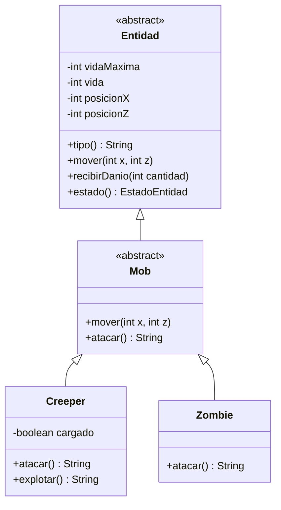

# MNRI Taller Git 2026

Proyecto de Marcelo Nicolas Romero Insfran (`mnri1904`) para la comision CYT646 F.

## Ejecutar

```bash
./mvnw spring-boot:run
```

La API queda disponible en `http://localhost:8080`.

## Endpoints

```text
GET /
GET /api/minecraft/mobs/creeper?x=3&z=2
GET /api/minecraft/mobs/zombie?x=1&z=-2
```

El controller construye el mob indicado en la URL y lo usa mediante el tipo
padre `Mob`. El JSON resultante muestra el estado heredado y el comportamiento
sobreescrito por cada hija.

## Diagrama de clases



La consigna del taller esta en
[alefq/afq-taller-git-2024](https://github.com/alefq/afq-taller-git-2024/blob/main/docs/TALLER_GIT.md).

Repositorio desarrollado para el taller de Git de CYT646 F.
